#Android Studio工具界面及基本操作

##1.工具界面

###1.1启动Android Studio

当我们点击Android Stuido,首先进入的节面，是这样的：

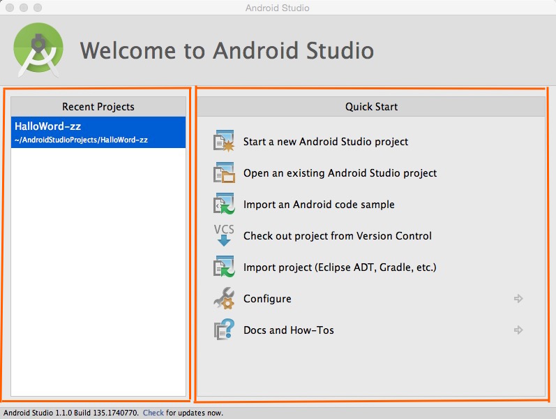

如图，在上面的图里，红色的方框分别圈出了左右两部分。

左边的部分--“ **Recent Project** ”,里面列出来的，是最近打开或创建的安卓项目。点击它们，就可以直接进入到Android Studio对它们进行编辑。

右边的部分--“ **Quick Start** ”,选择开始的方式。依次是：

* **“ Start a new Android Stuido project ”**, 新建一个Android Studio项目。
* **“ Open an existing Android Studio project ”**, 打开一个已经存在Android Studio项目。
* **“ Import an Android code sample ”**, 导入一个安卓代码示例。
* **“ Check out project from Version Control ”**, 从版本服务器中迁出项目。
* **" Import project(Eclipse ADT,Gradle,etc.) "**， 导入包括eclipse AdT,Gradle,etc.在内的项目
* **" Configure "**， 设置配置。
* **“ Docs and How-Tos ”**, 文档和用户指南。

###1.2正式进入操作面板
进入我们的Android Stuido项目，可以看到这样的界面：

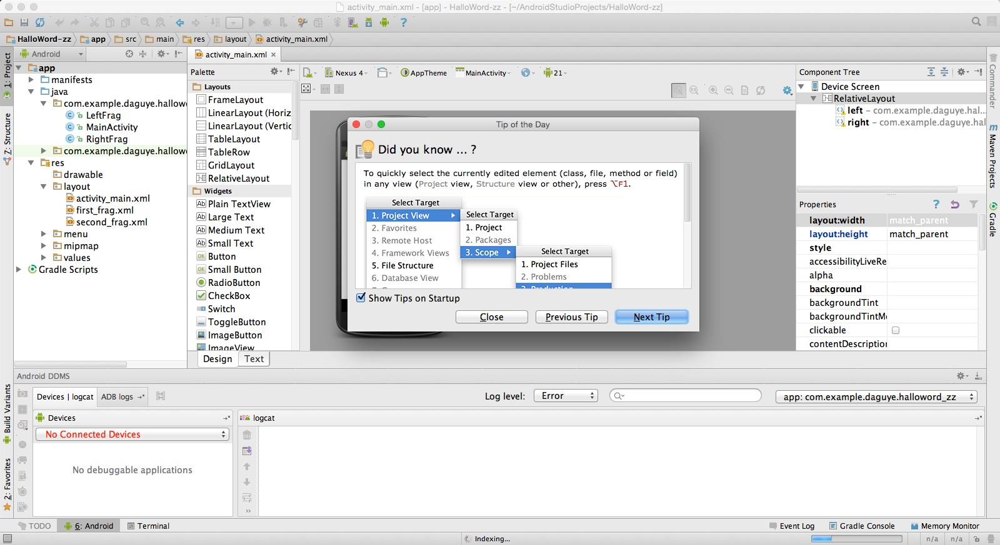

首先映入眼帘的，就是一个小弹窗，里面会有一些操作的小贴士，直接选择“Close”,就可以不用管它了。

关掉弹窗之后，就真正的进入到了工具操作页面。
我们可以看到这样的界面：

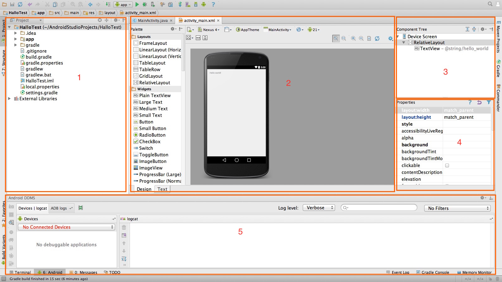

同样的，为了讲解的方便，我把它用红框分成了5个区域，并标上了数字，进行说明。

##1.3常用面板
###1.3.1project面板

在区域1中，可以看到当前项目的结构：

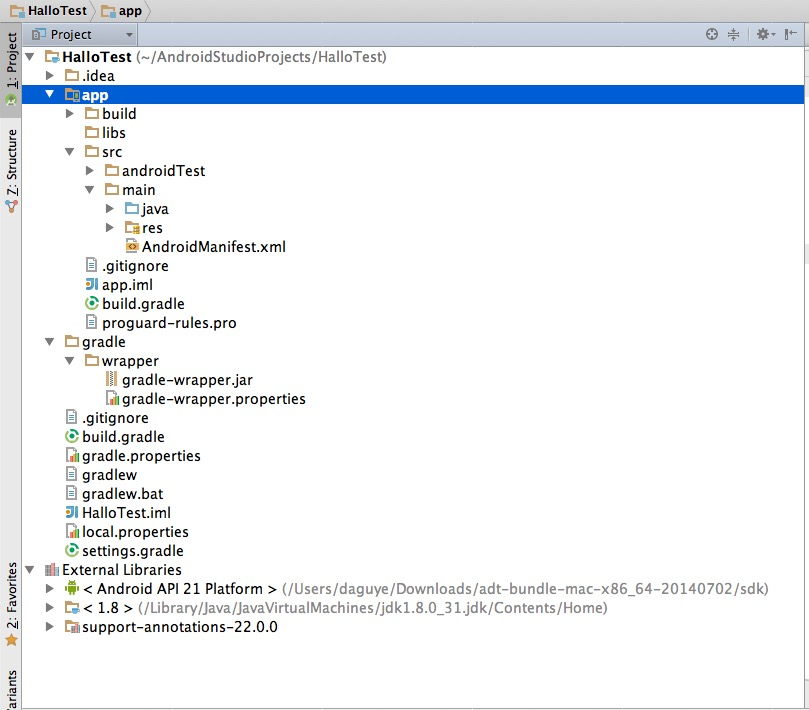

很多人之前使用eclipse的人,看到这些可能感觉会不习惯。

按照上图中的路径： 

* app->src->main->java，这是java文件目录，点它，你会看到熟悉的eclipse当中的结构，java代码都放在这里。

* app->src->main->res，这是资源文件目录，安卓项目的图片，布局文件等等都存在这里。

现在这样的话，是不是就习惯多了？

值得一提的是，  
在Android Studio当中，引入了**Module**的概念。也就是**模块**。  
大家如果对IntelliJ IDEA不太熟悉，  可能不知道模块这东西到底是什么。  
**模块**实际上就是一个可以进行编译、运行、测试以及调试的独立功能单元。模块当中包含有源代码、编译脚本以及用于特定任务的其它组成部分

简单的来说：  
 
* Android Studio的**project** ，相当于 Eclipse的**workspace**,  

* Android Studio的**module** ，相当于 Eclipse的**project**.  

当然，说到这里，在Project中，大家还可以来切换视图。
根据自己的需要，选择不同的视图。
加上上面的Project面板中，一共有三种视图模式。
可以点击如图当中的Project来切换它：

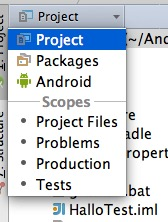

如图，点击选择“ Packages ”.

选择后，效果如下图：  
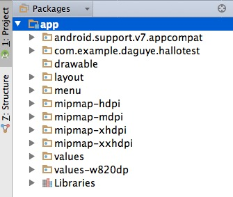  
  
只是显示了当前的Module列表和Module下面的目录,文件.  

同样的，我们再点击上图中的**Packages**,选择“Android”,
 
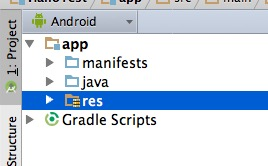  
Android视图下的一级目录分两个区域,一个是Module列表区域（“app”文件夹路径下）,一个是Gradle脚本区域（“Gradle Scripts”路径下）。 
Project的所有视图都是真实的目录.  
而在Android视图下,很大目录都是不存在的,由Android视图自动合并在了一起,方便我们理解和布置.  
所以，在想要添加文件到项目里面时候，最好是切换回Project视图。  
###1.3.2编辑区
故名思义，这里用于编辑文件，我们现在的2号区域，显示的是一个手机效果的预览图。
选择左下角的“Text”，切换到代码编辑，如下图所示：  

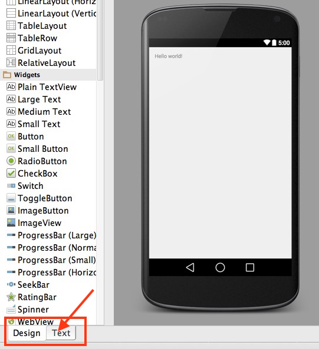

点击之后，效果如下：  
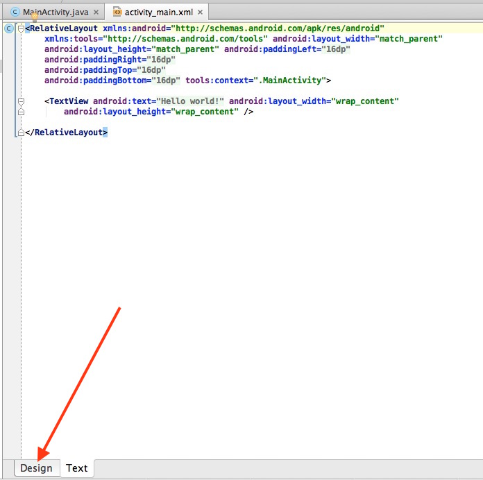   
点击“Design”，可以返回到原来的小手机界面。
对于其他的文件，
可以选择相应目录下的文件打开，就可以进行代码的编辑了。

###1.3.3 组件树 
 
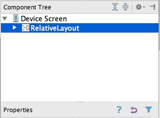   
这里主要用于显示布局当中的UI组件，通过组件树，我们可以很直观的看出布局当中，UI组件的关系。帮助理清布局的结构。

###1.3.4 properties面板  
 
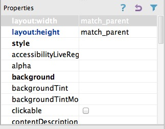   
如图，这是属性面板，从这里可以看到我们当前UI控件的属性。也可以在里面修改控件的属性。

###1.3.5 Android 面板

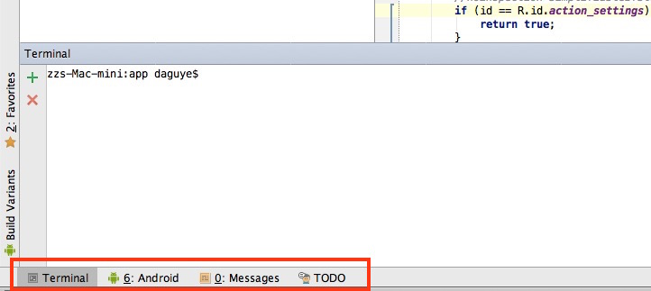

在这里可以看到红框理有4个选项卡，分别是:

- **Terminal**: 可以在这里直接输入命令行操作。
- **Android**： 打开可以看到DDMS中的设备信息和Logcat输出。也可以切换android logs。
- **Messages**: 消息提示。
- **TODO**：TODO是一种任务标签注释，在这里可以显示我们的TODO标签注释。

###1.4工具栏常用按钮
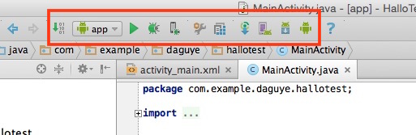

 从左到右，这里依次是：
 
* 编译右侧 module 列表中显示的 module 。
* 当前 project 的 module 列表。
* 运行左侧 module 列表中显示的 module 。
* debug 左侧 module 列表中显示的 module 。
* attach debugger to Android process 。
* 设置。
* 项目属性。
* 使用 Gradle 编译 project 。
* 虚拟机。
* SDK Manager 。
* DDMS 。  
  
##2.基本操作    
###2.1设置主题    
相信很多朋友都和我一样，在使用eclipse时，为换主题的事情头疼过。而在Android Studio当中，更换主题非常简单。下面来介绍Android Studio中设置主题的方法：

如下图，选择"Preferences..".   

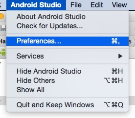     

**PS**: Windows系统中选择，File->Settings->Apperance  

之后出现下图,在右边面板的“ Theme ”中,选择**“ Darcula ”**：   
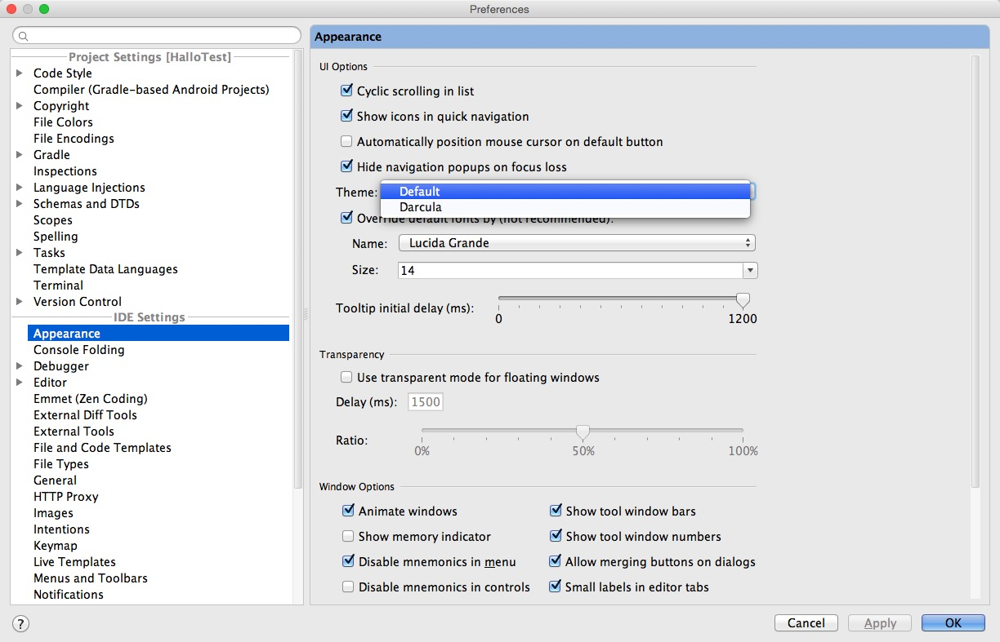

选择Darcula之后，会弹出提醒，要我们重启一次Android Studio.如下图：   
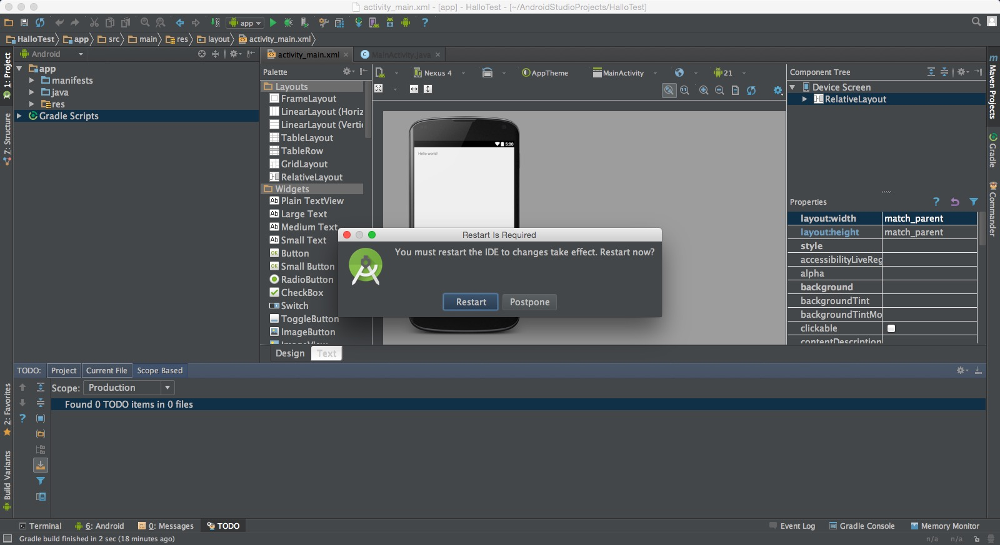

从上面的图，可以看到，主题已经变成了黑色。只需要选择“Restart”,重启之后，我们就完成了主题的更换。
###2.2字体大小
更换完主题之后，由于个人的需要不同，接下来，还可以自己来更换字体的大小风格。来满足视觉需求。
####2.2.1代码字体   
和之前更换主题差不多，进到"Preferences..",如下图：      
    
然后选择: Editor->Color&Fonts->Font:      
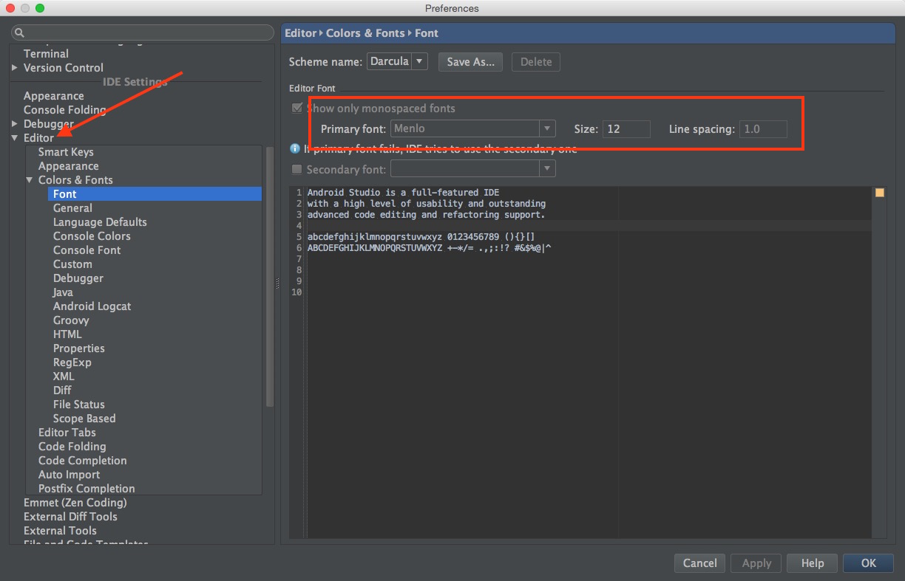   
Windows下，一次选择：  
File---->Settings---->IDE Settings----->Editor---->Colors&Fonts----->Font  

更改红框当中的"Size",决定字体大小，“Line spacing”，表示两行代码之间的间隔。   

#####2.2.2系统字体
之前说了设置代码的字体，不仅仅是代码字体，我们还可以去设置自己喜欢的系统字体。
如果要设置系统的字体，那么就需要找到Appearance选项，然后选中Override defalut fonts by(not recommended)，然后设置字体和大小即可。
Windows系统中，和设置主题类似的，File->Settings->Apperance
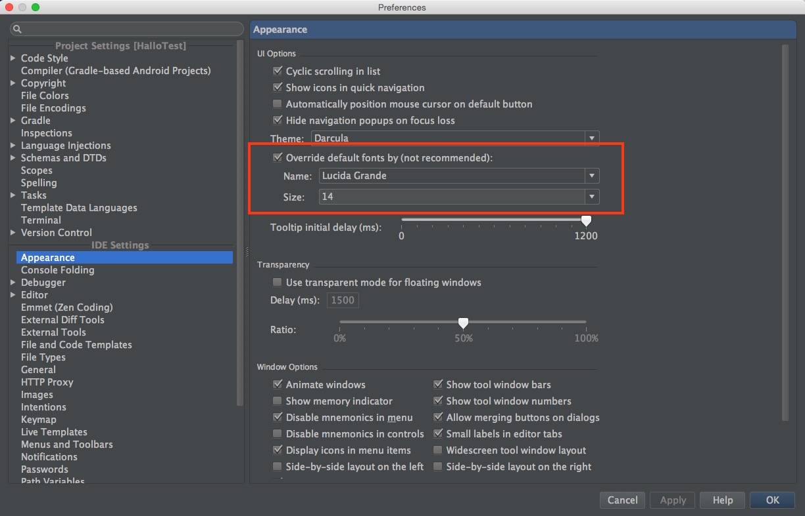

###2.3行号显示
有时候报错信息出来，明显指定了文件里的第多少行出错，但是当行数很多的时候，我们一行行的去数的话，肯定是个麻烦的办法。
这个时候，就可以通过显示行号，来快速的找到出错的地方。
行号显示的方法非常的简单。
打开一个文件-->鼠标放在project面板和编辑区面板之后的区域，点击鼠标右键。    
如下图：   
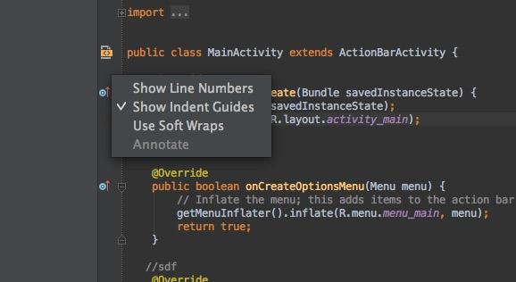   

选择“Show Line Numbers”，这样行号显示的设置就完成了。   

下面的是效果图：   
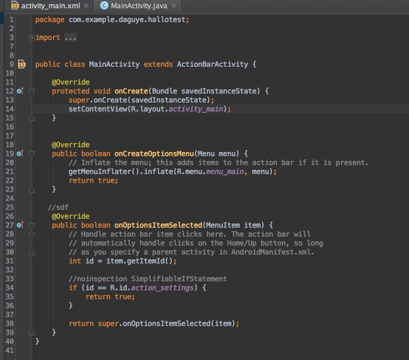   
###2.4项目文件的编码格式
在实际的编程当中，编码格式是很重要，假如没有重视，很可能造成乱码的现象出现。统一编码对于我们来说，是很重要的。
如果想设置项目的编码格式，首先要有一个项目，然后选中项目。
打开File->Setting->File Encodings.或者进入Preferences.
相信看过本篇文章上面教程的你，已经非常的熟练了。分别设置：

1. IDE Encoding
2. Project Encoding
3. Default encoding 

推荐都设置为UTF-8。
如图，统一你的编码格式。这非常重要。   
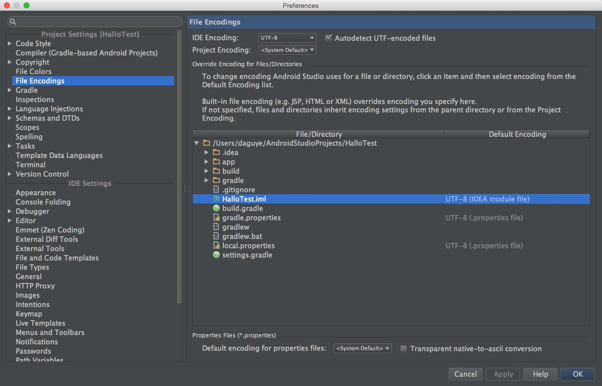   
###2.5快捷键设置

Android Studio非常人性化，为了适应使用者的需要，有一键导入选择快捷键的方式。方便了开发者，让大家快速的上手。   
仍然是之前的选择，打开Preferances,选择: keymap->keymaps，然后在下拉列表中，选择你喜欢的开发环境快捷键。如图所示：      
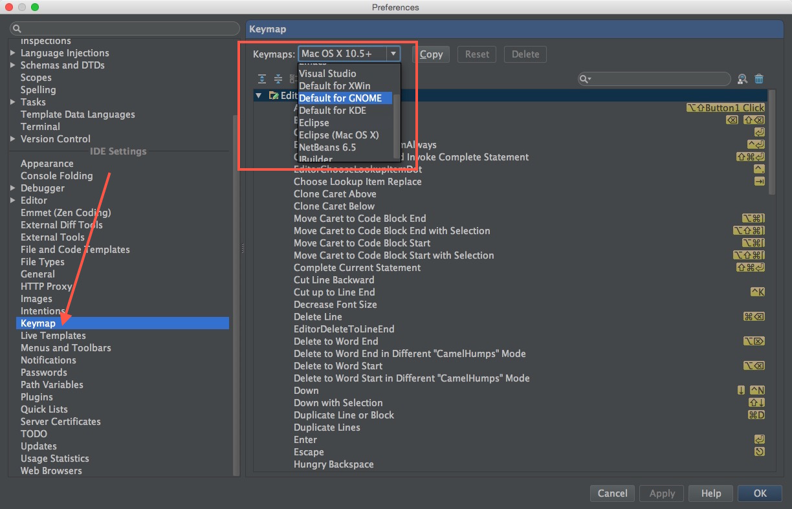   

好了，以上就是对Android Studio工具界面以及基本操作的介绍。

