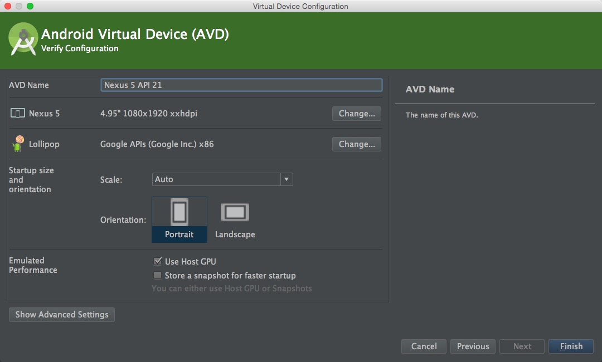
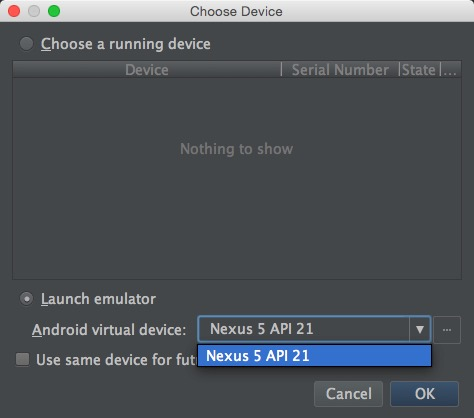
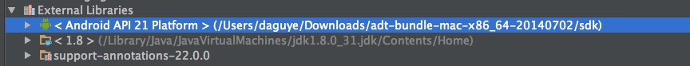
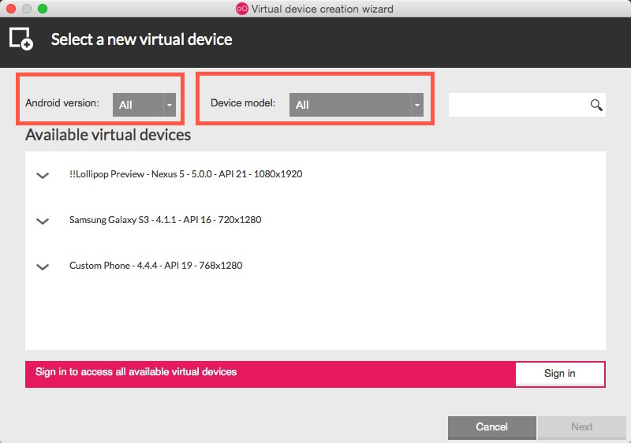

#Android Studio模拟器安装
-------
在进行安卓开发的时候，使用模拟器来测试项目，这是必不可少的。  
只有在实际的检查当中，才能发现我们的问题。  
下面将为大家介绍安装模拟器的两个方法：   

* ###直接在使用Android Studio中安装模拟器
* ###利用Genymotion安装模拟器  

##1.直接在使用Android Studio中安装模拟器  

####第一步
进入到Android Studio，点击工具栏中的“**AVD Manager**”图标。   
如下图所示：

  

####第二步 
进入到"AVD Manager"中    
"AVD Manager"的全称是：**Android Vitrtual Device Manager**,即安卓虚拟设备管理器。   
如下图所示，里面没有的任何设备。  
选择中间的按钮“** + Create a virtual device** ”   

  

####第三步  
 
我们跳转到了模拟器设置的界面，设置你需要的安卓模拟器属性。  
你可以选择模拟器的**尺寸（Size），分辨率(Resolution)，像素密度(Density)**。   


选择完毕后，点击右下方的“**Next**”选项。  
之后出现的界面，如下图所示：
  
System Image 是指系统镜像。  
这里我们选择“**Next**”.   
 
####第四步  
之后，界面出现下图的显示，可以看到之前设置好的模拟器信息。  
如果不满意也可以选择更改。  
在这里，选择“**Finish**”。完成模拟器创建。

   


在这里，我们的安卓模拟器创建可以说是告一段落了。  
点击如下图的绿色按钮，运行我们的安卓项目：  
  

出现选择一个用来运行的模拟器的界面，我们选择之前创建好的模拟器：  

  
  
------------ 
**不过当我们第一次创建安卓模拟器的时候，大多数人都会出现下面的问题**：
###Android Studio设备模拟机无法加载运行 
####报错：HAX kernel module is not installed 
如下图：
  

这里的“ HAXM ”，是用来管理硬件加速的。

我们需要安装它。  
**这里介绍两种安装HAXM的方法：** 
 
* 在在SDK自带的文件夹里面去安装HAXM。 
* 通过SDK Manager来安装HAXM


####方法一
在SDK自带的文件夹里面去安装HAXM。   
如果你不知道自己sdk的路径，可以通过Android Studio显示的路径找到它   
如下图：
  

根据我们查到的sdk的路径。    
再依照下列顺序打开:
sdk->extras->intel->Hardware_Accelerated_Execution_Manager    
就可以在文件夹中找到HAXM的安装文件。  
 
 **Windows**平台下：  
intelhaxm-android.exe   

 **Mac**平台下：   
IntelHAXM_1.1.1_for_10_9_and_above.dmg （10.9系统和10.9系统以上）  
IntelHAXM_1.1.1_for_below_10_9.dmg （10.9系统以下）   
 
点击IntelHAXM安装文件，进行安装。 

###1.1 Windonws系统下，intelhaxm安装
如果之前我们没有安装过虚拟机的话，很可能会报错。如下图：
  

意思是BIOS里面的“Virtualization Technology”选项没有打开。   
把它打开就能解决。   

重启电脑，长按F2，进入BIOS界面.但是不同厂商的电脑进入BIOS的按键不一样，请注意区别！    
在BIOS中，我们把选项卡移到“ Security ”，会看到这样的界面：
   
选择“ **Virtualization Technology** ”, 出现下面的界面。   
将"Virtualization Technology”选项设置为“**Enabled**”
    
 
之后退出BIOS，重新进入系统。  
到了这里，我们的安装就可以顺利进行了。     
重新找到intelhaxm安装文件，进行安装。   

###1.2 Mac系统下，IntelHAXM安装
Mac安装的时候，还需要权限。   
mac平台的用户直接输入账号名密码，就可以了。   
如图：   


一路默认选中继续，最后出现下图，选择“完成”，完成安装。
 
   

###1.3 Linux系统下， IntelHAXM(KVM)安装  
1.先检查cpu是否支持ardware virtualization,返回0表示不支持  
```egrep -c '(vmx|svm)' /proc/cpuinfo```  
2.检查是否支持upports kvm,需要安装工具pu-checker   
```sudo apt-get install cpu-checker ```  
3.执行检测命令  
```kvm-ok```  
返回

-----
```cpu支持 ```    
```"INFO: Your CPU supports KVM extensions ```  
```INFO: /dev/kvm exists ```  
```KVM acceleration can be used" ``` 
 
-----
```cpu不支持需要到bios中设置VT开启状态 ```  
```"INFO: KVM is disabled by your BIOS ```  
```HINT: Enter your BIOS setup and enable Virtualization Technology (VT),  ```    
```and then hard poweroff/poweron your system ```  
```KVM acceleration can NOT be used"```

----

开始安装kvm      
```sudo apt-get install qemu-kvm libvirt-bin ubuntu-vm-builder bridge-utils ```    
安装成功之后重启.   

添加用户到kvm,libvirtd组     
```sudo adduser your_user_name kvm```
```sudo adduser your_user_name libvirtd```

安装验证:     
```sudo virsh -c qemu:///system list```

安装成功出现如下命令   
```Id Name                 State```    
```----------------------------------```   
通过命令,启动虚拟机   
```<SDK directory>/tools/emulator-x86 -avd Your_AVD_Name -qemu -m 2047 -enable-kvm```

添加启动参数  
```-qemu -m 2047 -enable-kvm```


####方法二
通过SDK Manager来安装HAXM.   
点击" SDK Manager " ：   
    
勾选"Extras"-->“**Intel x86 Emulator Accelerator(HAXM installer)**”选项。    
然后点击“**Install packages..**”(我这里已经安装了，所以是灰色的)。如图：
  


-------
安装好HAXM之后，我们重新运行项目。   
可以看到模拟器已经出现：


模拟器已经启动，在如图标注的地方，有“HAX is working and emulator runs in virt mode”的字样。

第一次启动的时间相对稍慢，等一会，我们的模拟器启动完成。如下图：     


----------


##2.  利用Genymotion安装模拟器 

除了在Android Studio来直接安装安装模拟器之外，我们还可以用专门的模拟器软件来建立我们的安卓模拟器，它们的启动速度相对来说更快。安装也比较简单。
现在普遍使用Genymotion和海马模拟器，我们选择Genymotion，来安装我们的模拟器。
这里要说明的是，Genymotion的使用是需要注册的。
###2.1  Genymotion的下载
首先，在浏览器理，输入它的网址：https://www.genymotion.com 
进入genymotion官网：
 

**点击“Get Genymotion”**，之后跳转到下图：

  
这里有一个“ Free ”的版本，一个“Business ”的版本。   
上面有功能的对比，根据自己的需要选择。   
一般来说，选择“Free”版本的就可以。下拉到“Free”一列的底下，选择"Download":   

  
这里的字体是灰色的，不过仍然是可以点击的。

之后会跳转到下载选择的页面，根据自己的系统来选择不同版本的Genymotion:
###Windows:

上图中，左边1号红框中的是集成了VirtualBox的版本，右边2号红框中的则没有。
假如第一次使用Genymotion，也没有VirtualBox.
那么选择1号红框中的版本，点击下载链接，进行下载。

###Linux: 


如上图，根据自己使用的系统，选定相应的版本，
###Mac:

  
如上图，点击“Get Genymotion”下载即可。


点击之后就会下载。如果你**没有注册**的话，会弹出下图的提示框：

 

点击“Create account”注册一个就可以了，非常快。

###2.2  Genymotion的安装

Genymotion的安装也非常简单，一路默认就好了，就像平常我们安装其他的软件一样。   
安装完毕之后，我们会发现应用程序当中，多出了这两个：  
 

如果是下载了Windows集成了VirtualBox的版本，还会多出了virtualbox:   
 

我们打开Genymotion.可能会有这样的弹窗：  
 

不用管它，点击"Continue"。   
进入之后，发现我们在Android Studio之前建立的模拟器也在里面：   
   
选择界面中的“**Add**”按钮，建立一个新的模拟器。
进入如下图：
  
在这里的的“Android version”中，下拉选项可以选择安卓系统的版本。
“Device model”可以选择模拟器的设备模型。
或者直接点击"Available virtal devices"可用模拟器列表当中的选项。
之后选择右下角“Next”.
进入下面的界面，你可以给这个模拟器命名，底下还附有模拟器的详细信息：
   
选择“Next”,等待genymotion创建模拟器，如下图：
  
进度条达到100%，这时候，完成了创建。选择"Finish".

回到我们genymotion的主界面当中，可以看到我们已经多出了一个安卓模拟器，正是我们刚刚创建的.  
我们选中它之后，选择点击 “**Start”** 按钮启动它：
  
等待一会，创建完成后，桌面出现下图的界面：  
  
到了这里，genymotion安装到使用已经完毕。  
不过，我们的目的是和Android Studio一起来使用。   
我们需要回到之前下载genymotion的官网，下载**genymotion的插件**，把它集成到Android Studio里。  

在之前点击下载genymotion的页面，往下拉一点，会很明显看见如下图：

    

点击如上图的位置，下载“genymotion-idea-plugin.jar”.

下载完毕之后。   
打开我们的Android Studio,点击设置图标：  
   

进入如下界面，点击"Plugins"->"Install plugin from disk..".
   

找到刚刚下载好的genymotion的jar文件:   
  

之后保存退出。   
重新启动Android Studio。   
可以看到已经安装好的genymotion插件，证明Genymotion已经被集成在了Android Studio里面：
  

